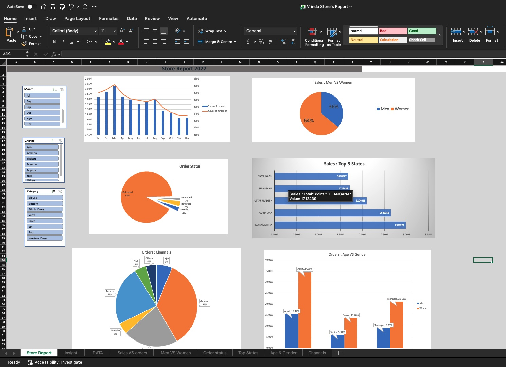

# 🛍️ Vrinda Store Sales Report - Excel Analysis

## Overview
An end-to-end sales data analysis for Vrinda Store, examining customer demographics,
channel performance, and regional trends to uncover actionable business insights.

## 📊 Dashboard Preview

## 🛠 Tools Used
- Microsoft Excel
- Data Cleaning & Transformation
- Pivot Tables & Charts
- Sales Analytics

## 📁 Files
| File | Description |
|------|-------------|
| [`Vrinda Store's Report.xlsx`](Vrinda%20Store's%20Report.xlsx) | Full Excel workbook with raw data, analysis & insights |

## 💡 Key Insights

- 👩 **Women drive ~65% of purchases** — Female customers significantly outspend male customers,
  making them the primary target demographic
- 🗺️ **Top 3 states contribute ~35% of revenue** — Maharashtra, Karnataka, and Uttar Pradesh
  are the highest performing regions for sales
- 🧑 **Adults aged 30–49 are the biggest buyers** — This age group accounts for ~50% of all orders,
  representing the store's core customer segment
- 📦 **Amazon, Flipkart & Myntra dominate at ~80%** — These three platforms generate the vast
  majority of sales, making them the most critical channels to invest in
- 📉 **Some orders result in returns/cancellations** — Data includes Delivered, Returned, Refunded
  and Cancelled statuses, suggesting room to improve fulfilment quality
- 👗 **Kurtas & Sets are top-selling categories** — These product types appear most frequently
  across all channels and regions

## 🎯 Business Recommendation

Target **women aged 30–49** living in **Maharashtra, Karnataka, and Uttar Pradesh**
by running ads, offers, and coupons on **Amazon, Flipkart, and Myntra** to
maximise sales conversion.
